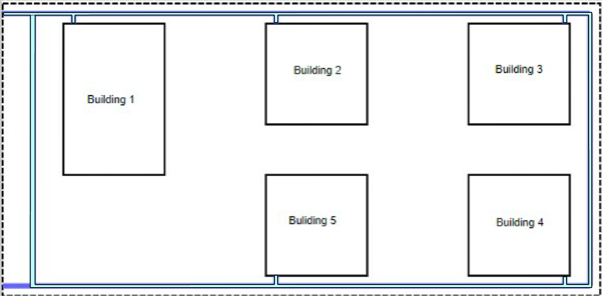
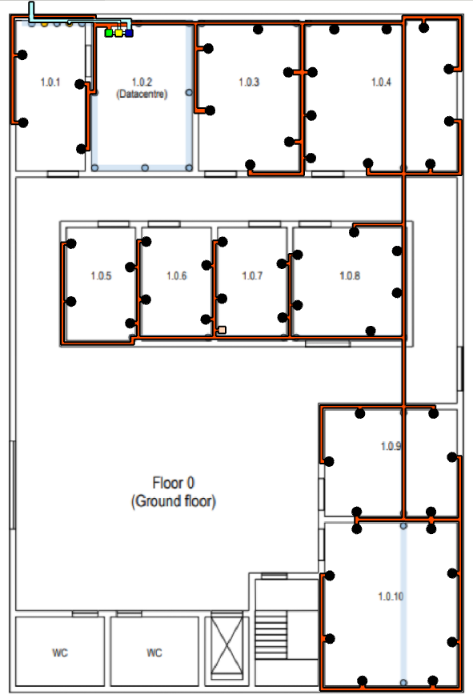
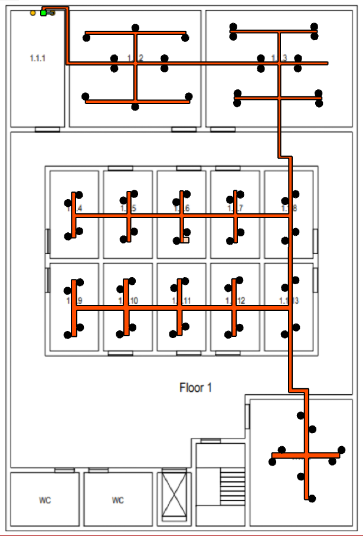
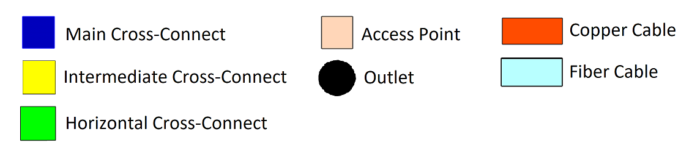

RCOMP 2021-2022 Project - Sprint 1 - Member 1181027 folder
===========================================

### Campus ###
 

All of the building on the campus are connected with Fiber Cables. Redudancy was included to make sure if one building has a problem all others will still work.

### Building 1 ###

To start with I decided to measure the area of each room to calculate the number of outlets needed per room. The standard 2 outlets per 10m^2 was used. 
As mentioned in the requirements Common areas, like the entrance hall, restrooms, and stairs, require no network outlets.
Room 1.1.1 will be used as a room to store the cross connect and as such will not have outlets.
Room 1.0.2 is the datacentre and as such will not have outlets. Room 1.0.1 will be used as a supporting room for the datacentre.

#### Room Area Measurements ####

* Ground Floor:

	* Room 1.0.1: 3.0m * 6.4m = 19.2m^2
	* Room 1.0.3: 4.2m * 6.3m = 26.5m^2
	* Room 1.0.4: 6.4m * 6.4m = 40.9m^2
	* Room 1.0.5: 2.9m * 4.8m = 13.9m^2
	* Room 1.0.6: 2.9m * 4.8m = 13.9m^2
	* Room 1.0.7: 2.9m * 4.8m = 13.9m^2
	* Room 1.0.8: 4.8m * 4.8m = 23.0m^2
	* Room 1.0.9: 5.6m * 4.6m = 25.8m^2
	* Room 1.0.10: 5.6m * 6.9m = 38.6m^2
	
* First Floor:

	* Room 1.1.2: 7.9m * 6.2m = 48.9m^2
	* Room 1.1.3: 8.0m * 6.4m = 51.2m^2
	* Room 1.1.4: 2.7m * 4.8m = 12.3m^2
	* Room 1.1.5: 2.7m * 4.8m = 12.3m^2
	* Room 1.1.6: 2.7m * 4.8m = 12.3m^2
	* Room 1.1.7: 2.7m * 4.8m = 12.3m^2
	* Room 1.1.8: 2.7m * 4.8m = 12.3m^2
	* Room 1.1.8: 2.7m * 4.8m = 12.3m^2
	* Room 1.1.9: 2.7m * 4.8m = 12.3m^2
	* Room 1.1.10: 2.7m * 4.8m = 12.3m^2
	* Room 1.1.11: 2.7m * 4.8m = 12.3m^2
	* Room 1.1.12: 2.7m * 4.8m = 12.3m^2
	* Room 1.1.13: 2.7m * 4.8m = 12.3m^2
	* Room 1.1.14: 5.6m * 6.9m = 38.6m^2
	
	
#### Resulting standard number of network outlets:

Given the fact that structured cabling standards specify a minimum of two outlets per work area, and also a ratio of two outlets for each 10 square meters of area, the result obtained were the following:

* Ground Floor:

	* Room 1.0.1: 19.2m^2 --> 4 outlets
	* Room 1.0.3: 26.5m^2 --> 6 outlets
	* Room 1.0.4: 40.9m^2 --> 10 outlets
	* Room 1.0.5: 13.9m^2 --> 4 outlets
	* Room 1.0.6: 13.9m^2 --> 4 outlets
	* Room 1.0.7: 13.9m^2 --> 4 outlets
	* Room 1.0.8: 23.0m^2 --> 6 outlets
	* Room 1.0.9: 25.8m^2 --> 6 outlets
	* Room 1.0.10: 38.6m^2 --> 8 outlets
	
* First Floor:

	* Room 1.1.2: 48.9m^2 --> 10 outlets
	* Room 1.1.3: 51.2m^2 --> 12 outlets
	* Room 1.1.4: 12.3m^2 --> 4 outlets
	* Room 1.1.5: 12.3m^2 --> 4 outlets
	* Room 1.1.6: 12.3m^2 --> 4 outlets
	* Room 1.1.7: 12.3m^2 --> 4 outlets
	* Room 1.1.8: 12.3m^2 --> 4 outlets
	* Room 1.1.8: 12.3m^2 --> 4 outlets
	* Room 1.1.9: 12.3m^2 --> 4 outlets
	* Room 1.1.10: 12.3m^2 --> 4 outlets
	* Room 1.1.11: 12.3m^2 --> 4 outlets
	* Room 1.1.12: 12.3m^2 --> 4 outlets
	* Room 1.1.13: 12.3m^2 --> 4 outlets
	* Room 1.1.14: 38.6m^2 --> 8 outlets
	
#### Ground Floor:
 
 
This floor houses the MC that recieves the connection from the outside and connects to all of the building's ICs. It also has its own IC and 2 HCs.
There is only 1 Access Point as it covers the whole floor with a 50m diameter range.

#### First Floor:
 
 
This floor makes use of the dropped ceiling to install cabling.
Like the other floor a single Access Point was used because it's enough to cover the whole floor.

#### Caption:
 
 
#### Full Inventory:

 * CAT6A Copper Cables:
	* Cables were measured by using the average length and multiplying it by the number of cables. To determine the average I used the shortest 2 cables and the longest 2 cables. The result is an approximation of the lenght of cable needed.
	* Floor 0: (2,7+6,5+52,9+56,8)/4=27,425m average --> 27,425\*52=1426,1m of copper cable needed, rounded up to 1500m to be safe.
	* Floor 1: (6,7+6,7+48,7+50,5)/4=28,15m average --> 28,15\*74=2083,1m of copper cable needed, rounded up to 2100m to be safe.
	* Total: 1500+2100=3600m of copper cable needed, rounded up to 4000m to be safe.
 * Optical Fiber Cables:
	* Building 1: 8,5m
	* Campus: 84,9m
	* Total: 93,4m, rounded up to 100m to be safe.
 * 126x ISO8877 outlet
 * Main Cross Connect (MC):
	* Fiber Optic Patch Panel 24
	* Fiber Optic Switch 24
	* Enclosure size: 4U (2U for all devices + 100% upgrade)
 * Intermediate Cross Connect (IC):
	* Fiber Optic Patch Panel 24
	* Fiber Optic Switch 24
	* Enclosure size: 4U (2U for all devices + 100% upgrade)
 * 2x Horizontal Cross Connect (HC):	
	* 2x Fiber Optic Patch Panel 24
	* 2x Fiber Optic Switch 24
	* 3x Copper Patch Panel 48 (1 for floor 0, 2 for floor 1)
	* Copper Patch Panel 24 (For floor 0)
	* 3x Copper Switch 48
	* Copper Switch 24
	* Enclosure size: 16U(Floor 0)/20U(Floor 1) (8U/10U for all devices + 100% upgrade)
 * Patch Cords:
	* 96 Patch Cords of Fiber Optic with 0.5m
	* 168 Patch Cords of Copper with 0.5m
 * 2x Wireless Access Point