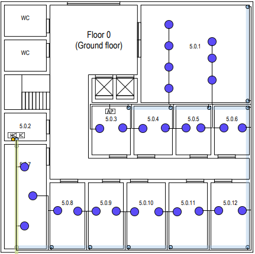

RCOMP 2021-2022 Project - Sprint 1 - Member 1200801 folder
===========================================
## Building 5:

## Ground Floor:

Room 5.0.2 is considered a storage area so there is no need to put any type of outlet there, as well as the restrooms, the entrance hall, and other common areas and it's where I decided to place the IC in because it is closer to the celling cable passageway and to the entrance, giving the possibility to access the next floor reducing the need for fiber optic cable.

The HC was placed next to the IC with the same purpose.

Since the entire space must have access to wi-fi, 1 AP was placed at the beginning of room 5.0.3, because it's the best position to cover the entire floor, considering its range.

The HC and the IC were placed in the same closet to reduce the space needed in the room to contain them.

Taking into account that the rule of at least 2 outlets per 10 m2 is followed:

### Room 5.0.1:

#### Dimensions:
  | Length: | Width: | Area: |
  |--------|-------|---------|
  |4.8cm → 8.57m|4.5cm → 8.04m| 68,9m2|
  
  - Calculations: [(68.9/10) * 2]
  - Number of outlets: 14
  

### Room 5.0.2:

#### Dimensions:
   | Length: | Width: | Area: |
   |--------|-------|---------|
   |1.9cm → 3.39m|1.3cm → 2.32m| 7.86m2|
  
  

### Room 5.0.3:

#### Dimensions:
   | Length: | Width: | Area: |
   |--------|-------|---------|
   |1.7cm → 3.04m|2.3cm → 4.11m| 12.49m2|

   - Calculations: [(12.49/10) * 2]
   - Number of outlets: 4
   
   

### Room 5.0.4:

#### Dimensions:
   | Length: | Width: | Area: |
   |--------|-------|---------|
   |1.7cm → 3.04m|2.3cm → 4.11m| 12.49m2|

   - Calculations: [(12.49/10) * 2]
   - Number of outlets: 4
   
   

### Room 5.0.5:

#### Dimensions:
   | Length: | Width: | Area: |
   |--------|-------|---------|
   |1.6cm → 2.86m|2.3cm → 4.11m| 11.74m2|

   - Calculations: [(11.74/10) * 2]
   - Number of outlets: 4
   
   

### Room 5.0.6:

#### Dimensions:
   | Length: | Width: | Area: |
   |--------|-------|---------|
   |1.6cm → 2.86m|2.3cm → 4.11m| 11.74m2|

   - Calculations: [(11.74/10) * 2]
   - Number of outlets: 4

### Room 5.0.7:

#### Dimensions:
   | Length: | Width: | Area: |
   |--------|-------|---------|
   |1.9cm → 3.39m|4.8cm → 8.57m| 29.05m2|

   - Calculations: [(29.05/10) * 2]
   - Number of outlets: 6

### Room 5.0.8:

#### Dimensions:
   | Length: | Width: | Area: |
   |--------|-------|---------|
   |1.6cm → 2.86m|3.1cm → 5.54m| 15.84m2|

   - Calculations: [(15.84/10) * 2]
   - Number of outlets: 4

### Room 5.0.9:

#### Dimensions:
   | Length: | Width: | Area: |
   |--------|-------|---------|
   |1.6cm → 2.86m|3.1cm → 5.54m| 15.84m2|

   - Calculations: [(15.84/10) * 2]
   - Number of outlets: 4

### Room 5.0.10:

#### Dimensions:
   | Length: | Width: | Area: |
   |--------|-------|---------|
   |1.7cm → 3.04m|3.1cm → 5.54m| 16.84m2|

   - Calculations: [(16.84/10) * 2]
   - Number of outlets: 4

### Room 5.0.11:

#### Dimensions:
   | Length: | Width: | Area: |
   |--------|-------|---------|
   |1.7cm → 3.04m|3.1cm → 5.54m| 16.84m2|

   - Calculations: [(16.84/10) * 2]
   - Number of outlets: 4
   

### Room 5.0.12:

#### Dimensions:
   | Length: | Width: | Area: |
   |--------|-------|---------|
   |1.7cm → 3.04m|3.1cm → 5.54m| 16.84m2|

   - Calculations: [(16.84/10) * 2]
   - Number of outlets: 4
   

##### Total Number Outlets: 56

##### Total Cable CAT6A:  105m

##### Total Fiber Optic Cable Type Monomode:  9,46m

#### Inventory:

* 1 IC:
    - Fiber Optic Patch Panel 24
    - Fiber Optic Switch 24
    - Enclosure size: 4U (2U for all devices + 100% upgrade)

* 1 HC:
    - Copper Switch 48
    - Copper Switch 24
    - Copper Patch Panel 48
    - Copper Patch Panel 24
    - Fiber Optic Switch 24
    - Fiber Optic Patch Panel 24
    - Enclosure size: 16U (8U for all devices + 100% upgrade)

* 56 Outlets

* Patch Cords:
    - 48 Patch Cords of Fiber Optic with 0.5m
    - 72 Patch Cords of Copper with 0.5m

* 105 m of CAT6A cable
* 9.46 m of Fiber Optic Cable Type Monomode
* 1 m of Fiber Optic Cable Type Multimode
* 1 Access Point

## First Floor:

Room 5.1.9 is considered a storage area so there is no need to put any type of outlet there, as well as the restrooms, the entrance hall, and other common areas.

The HC was placed next to floor cable passageway, reducing the need for fiber optic cable.

Since the entire space must have access to wi-fi, 1 AP was placed at the beginning of room 5.1.10, because it's the best position to cover the entire floor, considering its range.

Taking into account that the rule of at least 2 outlets per 10 m2 is followed:

### Room 5.1.1:

#### Dimensions:
  | Length: | Width: | Area: |
  |--------|-------|---------|
  |3.6cm → 6.43m|2.1cm → 3.75m| 24.11m2|
  
  - Calculations: [(24.11/10) * 2]
  - Number of outlets: 6

### Room 5.1.2:

#### Dimensions:
   | Length: | Width: | Area: |
   |--------|-------|---------|
   |3.6cm → 6.43m|2.3cm → 4.11m| 26.43m2|

  - Calculations: [(26.43/10) * 2]
  - Number of outlets: 6
  
  

### Room 5.1.3:

#### Dimensions:
   | Length: | Width: | Area: |
   |--------|-------|---------|
   |3.6cm → 6.43m|2.3cm → 4.11m| 26.43m2|

  - Calculations: [(26.43/10) * 2]
  - Number of outlets: 6
   
   

### Room 5.1.4:

#### Dimensions:
   | Length: | Width: | Area: |
   |--------|-------|---------|
   |1.9cm → 3.39m|3.1cm → 5.54m| 18.78m2|

  - Calculations: [(18.78/10) * 2]
  - Number of outlets: 4
  
   

### Room 5.1.5:

#### Dimensions:
   | Length: | Width: | Area: |
   |--------|-------|---------|
   |1.9cm → 3.39m|3.1cm → 5.54m| 18.78m2|

  - Calculations: [(18.78/10) * 2]
  - Number of outlets: 4
   
   

### Room 5.1.6:

#### Dimensions:
   | Length: | Width: | Area: |
   |--------|-------|---------|
   |2cm → 3.57m|3.1cm → 5.54m| 19.78m2|

  - Calculations: [(19.78/10) * 2]
  - Number of outlets: 4
   

### Room 5.1.7:

#### Dimensions:
   | Length: | Width: | Area: |
   |--------|-------|---------|
   |2cm → 3.57m|3.1cm → 5.54m| 19.78m2|

  - Calculations: [(19.78/10) * 2]
  - Number of outlets: 4
  
  
  
### Room 5.1.8:

#### Dimensions:
   | Length: | Width: | Area: |
   |--------|-------|---------|
   |2.5cm → 4.46m|4.8cm → 8.57m| 38.22m2|

  - Calculations: [(38.22/10) * 2]
  - Number of outlets: 8
  

### Room 5.1.9:

#### Dimensions:
   | Length: | Width: | Area: |
   |--------|-------|---------|
   |2.5cm → 4.46m|1.3cm → 2.32m| 10.35m2|
  

### Room 5.1.10:

#### Dimensions:
   | Length: | Width: | Area: |
   |--------|-------|---------|
   |2cm → 3.57m|2.3cm → 4.11m| 14.67m2|

  - Calculations: [(14.67/10) * 2]
  - Number of outlets: 4
  

##### Total Number Outlets: 46

##### Total Cable CAT6A: 102.32m

##### Total Fiber Optic Cable Type Multimode: 7 m

#### Inventory:

* 1 HC:
    - Copper Switch 48
    - Copper Patch Panel 48
    - Fiber Optic Switch 24
    - Fiber Optic Patch Panel 24
    - Enclosure size: 12U (6U for all devices + 100% upgrade)

* 46 Outlets

* Patch Cords:
    - 24 Patch Cords of Fiber Optic with 0.5m
    - 48 Patch Cords of Copper with 0.5m

* 102.32 m of CAT6A cable
* 7 m of Fiber Optic Cable Type Monomode
* 1 Access Point

