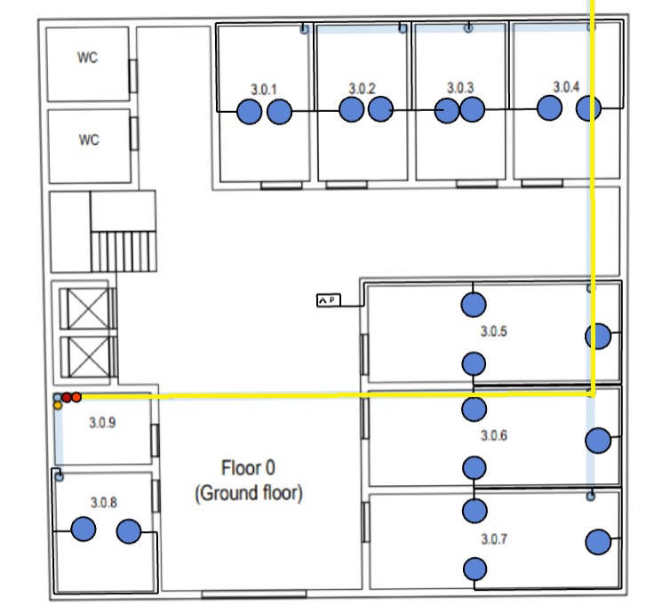
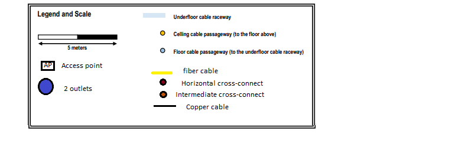
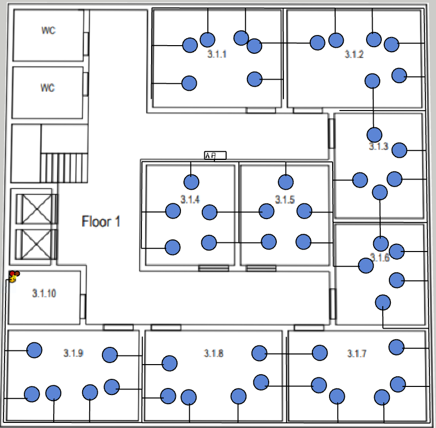

RCOMP 2021-2022 Project - Sprint 1 - Member 1201525 folder
===========================================
## Building 3:
entire building-> 20m x 20m;
5m scale of the image is equivalent to 2.5cm;

## Ground Floor:

Taking into account that the rule of at least 2 outlets per 10 m^2 is followed.

#### Room 3.0.1:

#### Dimensions:
   | Length: | Width: | Area: |
   |--------|-------|---------|
   |2.5cm → 5m|1.5cm → 3m|15 m^2|

  - Calculations: [(15/10) * 2]
  - Number of outlets: 4

#### Room 3.0.2:

#### Dimensions:
   | Length: | Width: | Area: |
   |--------|-------|---------|
   |2.5cm → 5m|1.5cm → 3m|15 m^2|

  - Calculations: [(15/10) * 2]
  - Number of outlets: 4

#### Room 3.0.3:

#### Dimensions:
   | Length: | Width: | Area: |
   |--------|-------|---------|
   |2.5cm → 5m|1.5cm → 3m|15 m^2|

  - Calculations: [(15/10) * 2]
  - Number of outlets: 4

#### Room 3.0.4:

#### Dimensions:
   | Length: | Width: | Area: |
   |--------|-------|---------|
   |2.5cm → 5m|1.85cm → 3.7m|18.5 m^2|

   - Calculations: [(18.5/10) * 2]
   - Number of outlets: 4

#### Room 3.0.5:

#### Dimensions:	
   | Length: | Width: | Area: |
   |--------|-------|---------|
   |4cm → 8m|1.6cm → 3.2m|25.6 m^2|

   - Calculations: [(25.6/10) * 2]
   - Number of outlets: 6

#### Room 3.0.6:

#### Dimensions:
   | Length: | Width: | Area: |
   |--------|-------|---------|
   |4cm → 8m|1.6cm → 3.2m|25.6 m^2|

   - Calculations: [(25.6/10) * 2]
   - Number of outlets: 6

#### Room 3.0.7:

#### Dimensions:
   | Length: | Width: | Area: |
   |--------|-------|---------|
   |4cm → 8m|1.6cm → 3.2m|25.6 m^2|

   - Calculations: [(25.6/10) * 2]
   - Number of outlets: 6

#### Room 3.0.8:

#### Dimensions:
   | Length: | Width: | Area: |
   |--------|-------|---------|
   |2cm → 4m|1.6cm → 3.2m|12.8m^2|

   - Calculations: [(12.8/10) * 2]
   - Number of outlets: 4
#### Room 3.0.9:

#### Dimensions:
   | Length: | Width: | Area: |
   |--------|-------|---------|
   |1.3cm → 2.6m|1.6cm → 3.2m|8.32 m^2|

   - Number of outlets: 0 due to being a storage.

##### Total Number Outlets: 64
##### Calculations of Cable CAT6A: 11.2(room 3.0.8)+27.6(rooms from 3.0.7 to 3.0.5)+25.2(rooms from 3.0.4 to 3.0.1) = 64m

##### Total Cable CAT6A: 64 m
##### Total Fiber Optic Cable Type Monomode: 14 m

#### Inventory:

* 1 IC:
    - Fiber Optic Patch Panel 48
    - Fiber Optic Switch 48
    - Enclosure size: 4U (3U for all devices + 50% upgrade)

* 1 HC:
    - Coper Switch 48
    - Coper Patch Panel 48
    - Fiber Optic Patch Panel 48
    - Fiber Optic Switch 48
    - Enclosure size: 13U (6U for all devices + 50% upgrade)

* Patch Coords:
    - 48 Patch Cords of Fiber Opitc with 0.5m
    - 96 Patch Cords of Copper with 0.5m

* 64 m of CAT6A cable
* 14 m of Fiber Optic Cable Type Monomode
* 1 Access Points

## First Floor:

Considering that the entire space must have access to wi-fi, I decided to strategically place 1 AP, in the center, so that it would cover the whole floor without any issues. 
No outlets are placed on storage room and WCs, like requested.

#### Room 3.1.1:

#### Dimensions:
   | Length: | Width: | Area: |
   |--------|-------|---------|
   |3.5cm → 7m|4.2cm → 8.4m|58.8 m3|

   - Calculations: [(58.8/10) * 2]
   - Number of outlets: 12

#### Room 3.1.2:

#### Dimensions:
   | Length: | Width: | Area: |
   |--------|-------|---------|
   |3.5cm → 7m|4.2cm → 8.4m|58.8 m2|

   - Calculations: [(58.8/10) * 2]
   - Number of outlets: 12

#### Room 3.1.3:

#### Dimensions:
   | Length: | Width: | Area: |
   |--------|-------|---------|
   |3.6cm → 7.2m|3.2cm → 6.4m|46.08 m2|

   - Calculations: [(46.08/10) * 2]
   - Number of outlets: 10

#### Room 3.1.4:

#### Dimensions:
   | Length: | Width: | Area: |
   |--------|-------|---------|
   |3.6cm → 7.2m|3.2cm → 6.4m|46.08 m2|

   - Calculations: [(46.08/10) * 2]
   - Number of outlets: 10

#### Room 3.1.5:

#### Dimensions:
   | Length: | Width: | Area: |
   |--------|-------|---------|
   |3.6cm → 7.2m|3.2cm → 6.4m|46.08 m2|

   - Calculations: [(46.08/10) * 2]
   - Number of outlets: 10

#### Room 3.1.6:

#### Dimensions:
   | Length: | Width: | Area: |
   |--------|-------|---------|
   |3.6cm → 7.2m|3.2cm → 6.4m|46.08 m2|

   - Calculations: [(46.08/10) * 2]
   - Number of outlets: 10

#### Room 3.1.7:

#### Dimensions:
   | Length: | Width: | Area: |
   |--------|-------|---------|
   |3cm → 6m|4.3cm → 8.6m|51.6 m2|

   - Calculations: [(51.6/10) * 2]
   - Number of outlets: 12

#### Room 3.1.8:

#### Dimensions:
   | Length: | Width: | Area: |
   |--------|-------|---------|
   |3cm → 6m|4.3cm → 8.6m|51.6 m2|

   - Calculations: [(51.6/10) * 2]
   - Number of outlets: 12

#### Room 3.1.9:

#### Dimensions:
   | Length: | Width: | Area: |
   |--------|-------|---------|
   |3cm → 6m|4.3cm → 8.6m|51.6 m2|

   - Calculations: [(51.6/10) * 2]
   - Number of outlets: 12

#### Room 3.1.10:

#### Dimensions:
   | Length: | Width: | Area: |
   |--------|-------|---------|
   |1.7cm → 3.4m|2cm → 4m|13.6 m2|

   - Number of outlets: 0 due to being a storage.

##### Total Number Outlets: 100
##### Total Cable CAT6A:  146.9 m
##### Total Fiber Optic Cable Type Multimode: 1 m

#### Inventory:

* 1 HC:
    - Fiber Optic Patch Panel 48  
    - Copper Switch 48
    - Copper Patch Panel 48
    - Enclosure size: 10U (5U for all devices + 50% for upgrade)

* 100 Outlets

* 146.9 m of CAT6A cable
* 1 m of Fiber Optic Cable Type Multimode
* 1 Access Points

