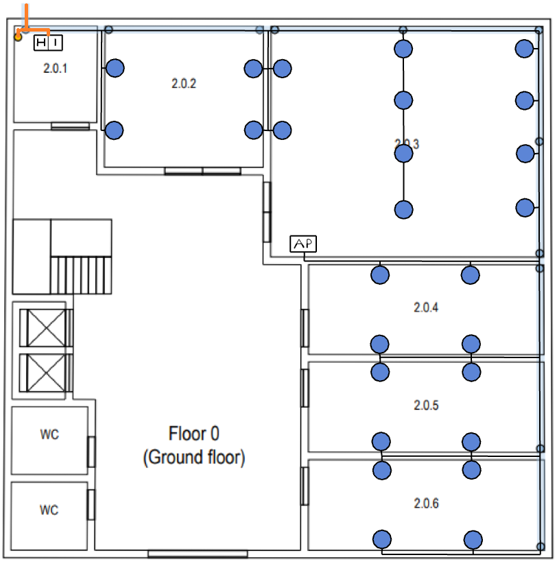
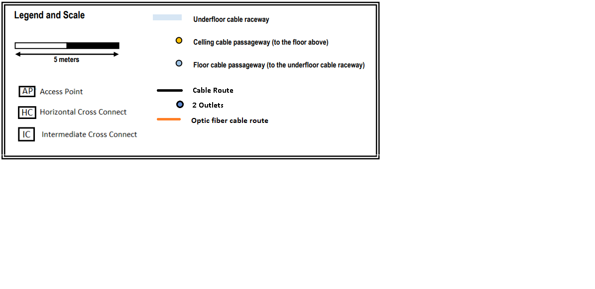
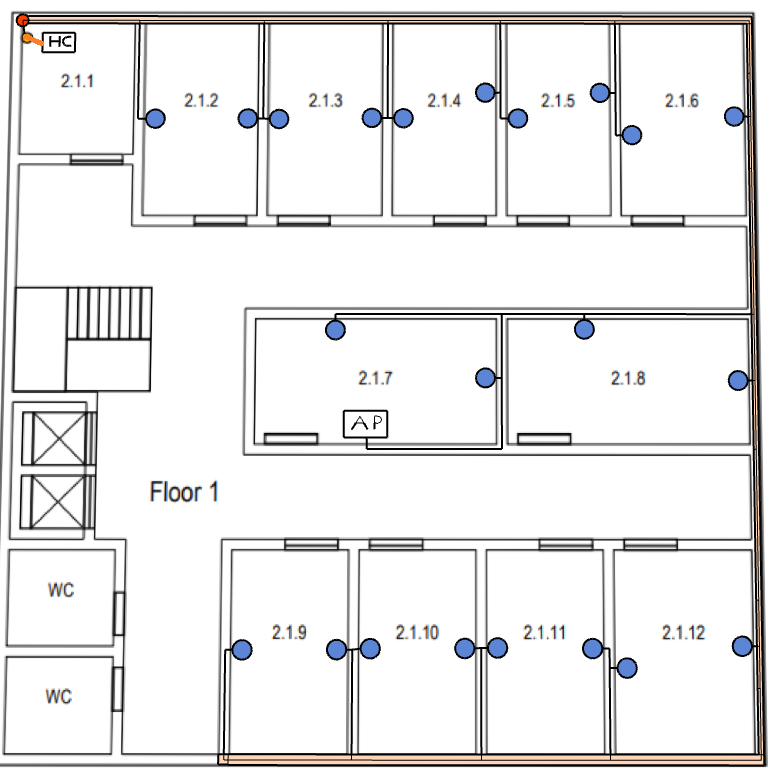
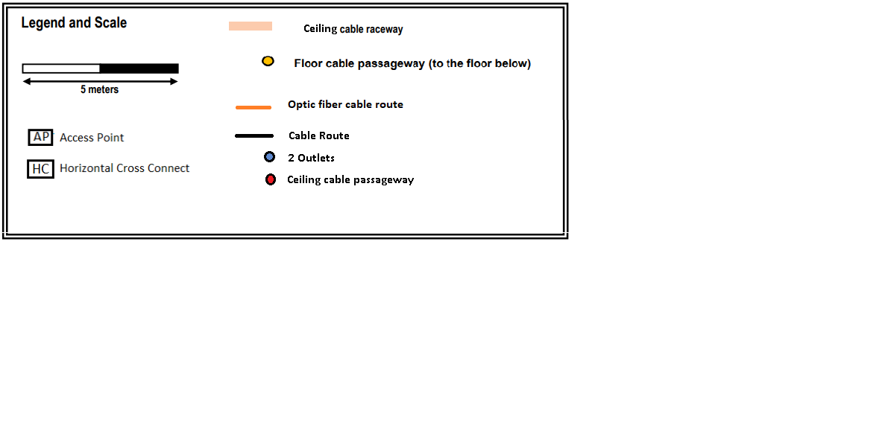

RCOMP 2021-2022 Project - Sprint 1 - Member 1201654 folder
===========================================
## Building 2:

## Ground Floor:

Room 2.0.1 is considered a storage area so there is no need to put any type of outlet there, as well as the restrooms, the entrance hall, and other common areas.

I decided to place the IC in room 2.0.1 because it is closer to the celling cable passageway and to the entrance, giving the possibility to access the next floor reducing the need for fiber optic cable type monomode.

I also placed the HC next to the IC with the same purpose, reducing the need for fiber optic cable type multimode.

Considering that the entire space must have access to wi-fi, I decided to strategically place 1 AP, at the beginning of room 2.0.3, because its range is 50m in diameter, being possible to cover the entire floor.

I decided to put the HC and the IC in the same closet to reduce the space needed in the room to contain them.

Taking into account that the rule of at least 2 outlets per 10 m2 is followed.

### Room 2.0.1:

#### Dimensions:
  | Length: | Width: | Area: |
  |--------|-------|---------|
  |1.6cm → 3.2m|1.9cm → 3.8m|12.16 m2|
  
  

### Room 2.0.2:

#### Dimensions:
   | Length: | Width: | Area: |
   |--------|-------|---------|
   |2.9cm → 5.8m|2.6cm → 5.2m|30.16 m2|

  - Calculations: [(30.16/10) * 2]
  - Number of outlets: 8
  
  

### Room 2.0.3:

#### Dimensions:
   | Length: | Width: | Area: |
   |--------|-------|---------|
   |5.1cm → 10.2m|4.5cm → 9m|91.8 m2|

   - Calculations: [(91.8/10) * 2]
   - Number of outlets: 20
   
   

### Room 2.0.4:

#### Dimensions:
   | Length: | Width: | Area: |
   |--------|-------|---------|
   |4.5cm → 9m|2cm → 4m|36 m2|

   - Calculations: [(36/10) * 2]
   - Number of outlets: 8
   
   

### Room 2.0.5:

#### Dimensions:
   | Length: | Width: | Area: |
   |--------|-------|---------|
   |4.5cm → 9m|2cm → 4m|36 m2|

   - Calculations: [(36/10) * 2]
   - Number of outlets: 8
   
   

### Room 2.0.6:

#### Dimensions:
   | Length: | Width: | Area: |
   |--------|-------|---------|
   |4.5cm → 9m|2cm → 4m|36 m2|

   - Calculations: [(36/10) * 2]
   - Number of outlets: 8
   
   

##### Total Number Outlets: 52

##### Room 2.0.1 (Total cable used): 5.4 m

##### Room 2.0.2 (Total cable used): 10.7 m

##### Room 2.0.3 (Total cable used): 35 m

##### Room 2.0.4 (Total cable used): 10.3 m

##### Room 2.0.5 (Total cable used): 9.9 m

##### Room 2.0.6 (Total cable used): 9.9 m

##### Total Cable CAT6A: 81 m

##### Total Fiber Optic Cable Type Monomode: 7 m

#### Inventory:

* 1 IC:
    - Fiber Optic Patch Panel 24
    - Fiber Optic Switch 24
    - Enclosure size: 4U (2U for all devices + 100% upgrade)

* 1 HC:
    - Copper Switch 48
    - Copper Switch 24
    - Copper Patch Panel 48
    - Copper Patch Panel 24
    - Fiber Optic Switch 24
    - Fiber Optic Patch Panel 24
    - Enclosure size: 16U (8U for all devices + 100% upgrade)

* 52 Outlets

* Patch Cords:
    - 48 Patch Cords of Fiber Optic with 0.5m
    - 72 Patch Cords of Copper with 0.5m

* 81 m of CAT6A cable
* 7 m of Fiber Optic Cable Type Monomode
* 1 m of Fiber Optic Cable Type Multimode
* 1 Access Point

## First Floor:

Room 2.1.1 is considered a storage area so there is no need to put any type of outlet there, as well as the restrooms, the entrance hall, and other common areas.

I also placed the HC next to floor cable passageway, reducing the need for fiber optic cable type monomode.

Considering that the entire space must have access to wi-fi, I decided to strategically place 1 AP, at the beginning of room 2.1.7, because its range is 50m in diameter, being possible to cover the entire floor.

Taking into account that the rule of at least 2 outlets per 10 m2 is followed.

### Room 2.1.1:

#### Dimensions:
  | Length: | Width: | Area: |
  |--------|-------|---------|
  |3.8 m|3.4 m|13 m2|
  
  

### Room 2.1.2:

#### Dimensions:
   | Length: | Width: | Area: |
   |--------|-------|---------|
   |2.8 m|4.9 m|13.7 m2|

  - Calculations: [(13.7/10) * 2]
  - Number of outlets: 4
  
  

### Room 2.1.3:

#### Dimensions:
   | Length: | Width: | Area: |
   |--------|-------|---------|
   |2.8 m|4.9 m|13.7 m2|

  - Calculations: [(13.7/10) * 2]
  - Number of outlets: 4
   
   

### Room 2.1.4:

#### Dimensions:
   | Length: | Width: | Area: |
   |--------|-------|---------|
   |2.6 m|4.9 m|12.7 m2|

  - Calculations: [(12.7/10) * 2]
  - Number of outlets: 4
   
   

### Room 2.1.5:

#### Dimensions:
   | Length: | Width: | Area: |
   |--------|-------|---------|
   |2.7 m|4.9 m|13.2 m2|

  - Calculations: [(13.2/10) * 2]
  - Number of outlets: 4
   
   

### Room 2.1.6:

#### Dimensions:
   | Length: | Width: | Area: |
   |--------|-------|---------|
   |3.1 m|4.9 m|15.2 m2|

  - Calculations: [(15.2/10) * 2]
  - Number of outlets: 4
   

### Room 2.1.7:

#### Dimensions:
   | Length: | Width: | Area: |
   |--------|-------|---------|
   |6.1 m|3.2 m|20 m2|

  - Calculations: [(20/10) * 2]
  - Number of outlets: 4
  
  
  
### Room 2.1.8:

#### Dimensions:
   | Length: | Width: | Area: |
   |--------|-------|---------|
   |6.1 m|3.2 m|20 m2|

  - Calculations: [(20/10) * 2]
  - Number of outlets: 4
  

### Room 2.1.9:

#### Dimensions:
   | Length: | Width: | Area: |
   |--------|-------|---------|
   |2.9 m|5 m|14.5 m2|

  - Calculations: [(14.5/10) * 2]
  - Number of outlets: 4
  

### Room 2.1.10:

#### Dimensions:
   | Length: | Width: | Area: |
   |--------|-------|---------|
   |2.9 m|5 m|14.5 m2|

  - Calculations: [(14.5/10) * 2]
  - Number of outlets: 4
  
  
  
### Room 2.1.11:

#### Dimensions:
   | Length: | Width: | Area: |
   |--------|-------|---------|
   |2.9 m|5 m|14.5 m2|

  - Calculations: [(14.5/10) * 2]
  - Number of outlets: 4
  
  
  
### Room 2.1.12:

#### Dimensions:
   | Length: | Width: | Area: |
   |--------|-------|---------|
   |3.5 m|5 m|17.5 m2|

  - Calculations: [(17.5/10) * 2]
  - Number of outlets: 4

##### Total Number Outlets: 44

##### Room 2.1.1 (Total cable used): 6.7 m

##### Room 2.1.2 (Total cable used): 6.5 m

##### Room 2.1.3 (Total cable used): 6.5 m

##### Room 2.1.4 (Total cable used): 6.2 m

##### Room 2.1.5 (Total cable used): 6.2 m

##### Room 2.1.6 (Total cable used): 6.9 m

##### Room 2.1.7 (Total cable used): 16.3 m

##### Room 2.1.8 (Total cable used): 13.6 m

##### Room 2.1.9 (Total cable used): 8.7 m

##### Room 2.1.10 (Total cable used): 8.7 m

##### Room 2.1.11 (Total cable used): 8.7 m

##### Room 2.1.12 (Total cable used): 13.6 m

##### Total Cable CAT6A: 109.2 m

##### Total Fiber Optic Cable Type Monomode: 1 m

#### Inventory:

* 1 HC:
    - Copper Switch 48
    - Copper Patch Panel 48
    - Fiber Optic Switch 24
    - Fiber Optic Patch Panel 24
    - Enclosure size: 12U (6U for all devices + 100% upgrade)

* 44 Outlets

* Patch Cords:
    - 24 Patch Cords of Fiber Optic with 0.5m
    - 48 Patch Cords of Copper with 0.5m

* 109.2 m of CAT6A cable
* 1 m of Fiber Optic Cable Type Monomode
* 1 Access Point

