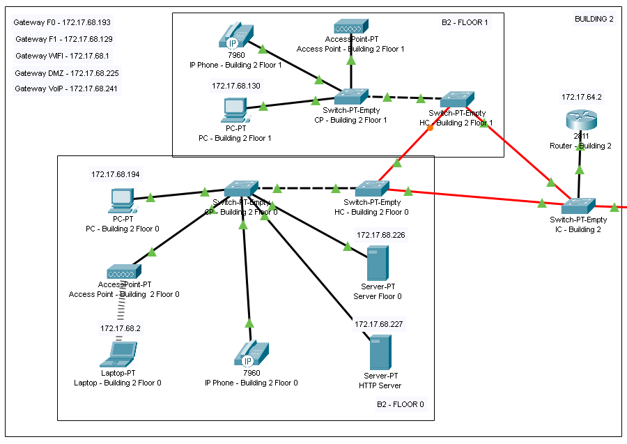
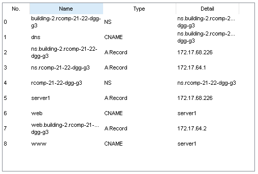

RCOMP 2021-2022 Project - Sprint 3 - Member 1201654 folder
===========================================
### Guilherme Pais Pereira

-------------------------------------------------------------------

### Building 2 Topology

This is a screenshot of Building 2.
-------------------------------------------------------------------

-------------------------------------------------------------------

### IP Subnetting

IP Subnetting decisions can be consulted in the previous sprint README.md file.

-------------------------------------------------------------------

| VLAN Location|  VLAN ID   |     Network IP    | Default Gateway |
| ------------ | ---------- | ----------------- | --------------- |
|   Floor 0    |    306     | 172.17.68.192/27  | 172.17.68.193   |
|   Floor 1    |    307     | 172.17.68.128/26  | 172.17.68.129   |
|   Wi-Fi      |    308     | 172.17.68.0/25    | 172.17.68.1     |
|   DMZ	       |    309     | 172.17.68.224/28  | 172.17.68.225   |
|   VoIP       |    310     | 172.17.68.240/28  | 172.17.68.241   |

-------------------------------------------------------------------

### VoIP service

VoIP service decisions for building 2.

-------------------------------------------------------------------

|Building|  ITS Server |Phone Number|
|:------:|:-----------:|:----------:|
|    2   |172.17.68.241|    1001    |
|    2   |172.17.68.241|    1002    |

-------------------------------------------------------------------

### DNS server to establish a DNS domains tree

DNS configurations for building 2.

-------------------------------------------------------------------

|Building|     IPv4    |          DNS Domain         |         DNS Name Server        |
|:------:|:-----------:|:---------------------------:|:------------------------------:|
|    2   |172.17.68.226|building-2.rcomp-21-22-dgg-g3|ns.building-2.rcomp-21-22-dgg-g3|

-------------------------------------------------------------------

### DNS Database Record

This is a screenshot of the server DNS database.
-------------------------------------------------------------------

